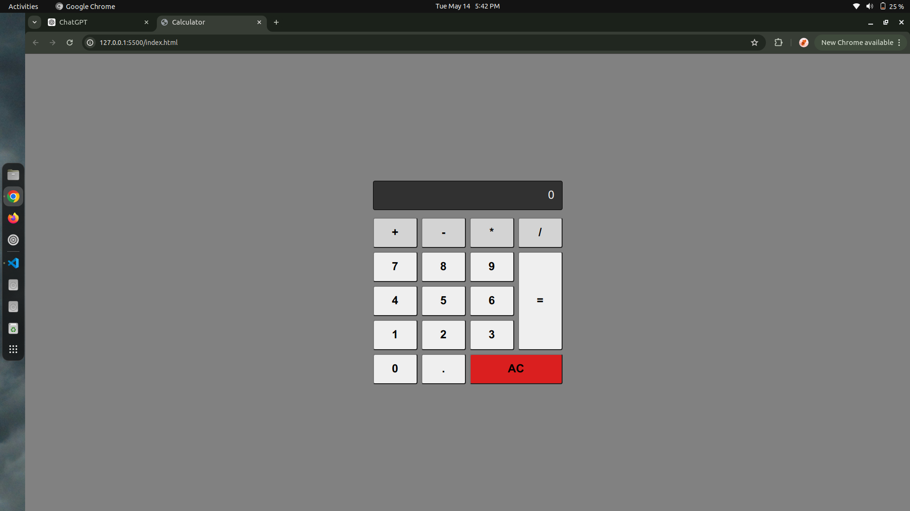
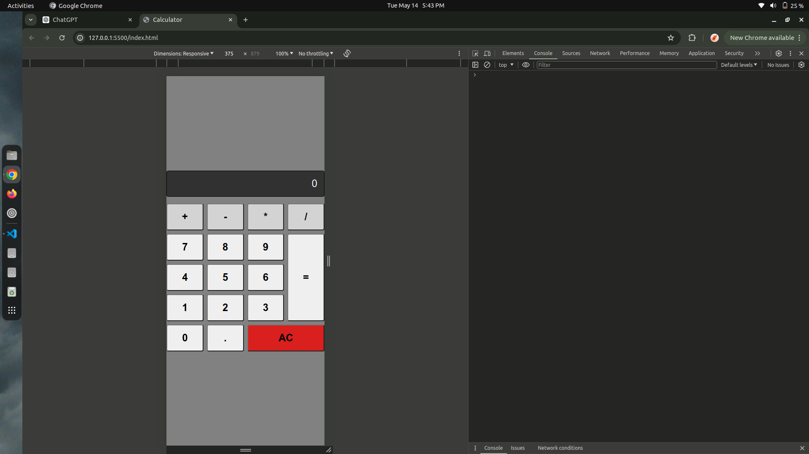

# Calculator

A basic calculator application built using HTML, CSS, and JavaScript. This calculator supports basic arithmetic operations such as addition, subtraction, multiplication, and division.

## Features

- Basic arithmetic operations: addition, subtraction, multiplication, and division.
- Clear button to reset the calculation.
- Responsive design for better user experience on different devices.

## Demo




## Getting Started

### Prerequisites

To run this project, you only need a modern web browser.

### Installation

1. Clone the repository:
   ```bash
   git clone https://github.com/debrajroyofficial000/Calculator.git
   ```
2. Navigate to the project directory:
   ```bash
   cd Calculator
   ```
3. Open the `index.html` file in your web browser to use the calculator.

## Usage

- Click the buttons to input numbers and operations.
- Click the `=` button to evaluate the expression.
- Click the `AC` button to clear the current input.

## Project Structure

simple-calculator/
│
├── assets # assets for screenshots
│ ├── s1.png
│ ├── s2.png
├── index.html # The main HTML file
├── style.css # The CSS file for styling
├── script.js # The JavaScript file for calculator functionality
└── README.md # Project documentation

## DEMO

[Demo]()
